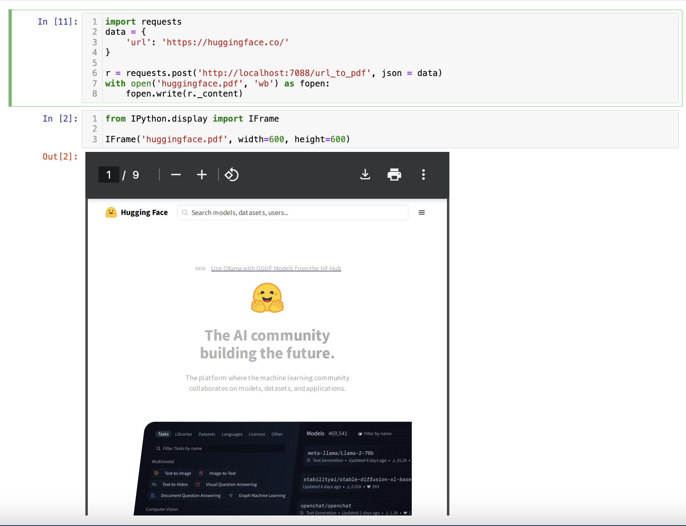
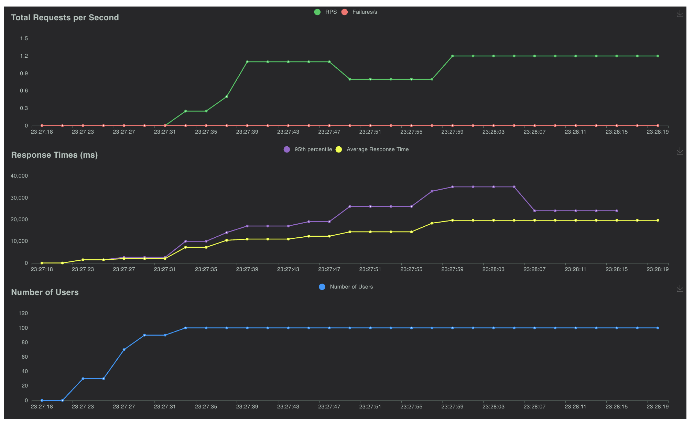

# dynamic-batch-RAG-pipeline

Dynamic batching for Document Layout and OCR, suitable for RAG.

1. Dynamic batching for SOTA Document Layout and OCR, suitable to serve better concurrency.
2. Continuous batching for Causal based OCR models.
3. Can serve user defined max concurrency.
4. Disconnected signal, so this is to ensure early stop for continuous batching.
5. Extra tool, convert any URL to PDF file.

## Available models

### Document Layout

1. https://github.com/opendatalab/DocLayout-YOLO

### OCR

1. https://huggingface.co/stepfun-ai/GOT-OCR2_0

## how to install

Using PIP with git,

```bash
pip3 install git+https://github.com/mesolitica/dynamic-batch-RAG-pipeline
```

Or you can git clone,

```bash
git clone https://github.com/mesolitica/dynamic-batch-RAG-pipeline && cd dynamic-batch-RAG-pipeline
```

## how to

### Supported parameters

```bash
python3 -m dynamicbatch_ragpipeline.main --help
```

```text
usage: main.py [-h] [--host HOST] [--port PORT] [--loglevel LOGLEVEL] [--reload RELOAD]
               [--enable-doc-layout ENABLE_DOC_LAYOUT] [--model-doc-layout MODEL_DOC_LAYOUT] [--enable-ocr ENABLE_OCR]
               [--model-ocr MODEL_OCR] [--dynamic-batching-microsleep DYNAMIC_BATCHING_MICROSLEEP]
               [--dynamic-batching-doc-layout-batch-size DYNAMIC_BATCHING_DOC_LAYOUT_BATCH_SIZE]
               [--dynamic-batching-ocr-batch-size DYNAMIC_BATCHING_OCR_BATCH_SIZE] [--accelerator-type ACCELERATOR_TYPE]
               [--max-concurrent MAX_CONCURRENT] [--static-cache STATIC_CACHE]
               [--static-cache-max-length STATIC_CACHE_MAX_LENGTH] [--enable-url-to-pdf ENABLE_URL_TO_PDF]
               [--playwright-max-concurrency PLAYWRIGHT_MAX_CONCURRENCY]

Configuration parser

options:
  -h, --help            show this help message and exit
  --host HOST           host name to host the app (default: 0.0.0.0, env: HOSTNAME)
  --port PORT           port to host the app (default: 7088, env: PORT)
  --loglevel LOGLEVEL   Logging level (default: INFO, env: LOGLEVEL)
  --reload RELOAD       Enable hot loading (default: False, env: RELOAD)
  --enable-doc-layout ENABLE_DOC_LAYOUT
                        Enable document layout detection (default: True, env: ENABLE_DOC_LAYOUT)
  --model-doc-layout MODEL_DOC_LAYOUT
                        Model type (default: yolo10, env: MODEL_DOC_LAYOUT)
  --enable-ocr ENABLE_OCR
                        Enable OCR (default: True, env: ENABLE_OCR)
  --model-ocr MODEL_OCR
                        Model type (default: got_ocr2_0, env: MODEL_OCR)
  --dynamic-batching-microsleep DYNAMIC_BATCHING_MICROSLEEP
                        microsleep to group dynamic batching, 1 / 1e-4 = 10k steps for second (default: 0.0001, env:
                        DYNAMIC_BATCHING_MICROSLEEP)
  --dynamic-batching-doc-layout-batch-size DYNAMIC_BATCHING_DOC_LAYOUT_BATCH_SIZE
                        maximum of batch size for document layout during dynamic batching (default: 16, env:
                        DYNAMIC_BATCHING_DOC_LAYOUT_BATCH_SIZE)
  --dynamic-batching-ocr-batch-size DYNAMIC_BATCHING_OCR_BATCH_SIZE
                        maximum of batch size for OCR during dynamic batching (default: 16, env:
                        DYNAMIC_BATCHING_OCR_BATCH_SIZE)
  --accelerator-type ACCELERATOR_TYPE
                        Accelerator type (default: cuda, env: ACCELERATOR_TYPE)
  --max-concurrent MAX_CONCURRENT
                        Maximum concurrent requests (default: 100, env: MAX_CONCURRENT)
  --static-cache STATIC_CACHE
                        Preallocate KV Cache for faster inference (default: False, env: STATIC_CACHE)
  --static-cache-max-length STATIC_CACHE_MAX_LENGTH
                        Maximum concurrent requests (default: 8192, env: STATIC_CACHE_MAX_LENGTH)
  --enable-url-to-pdf ENABLE_URL_TO_PDF
                        Enable URL to PDF using Playwright (default: True, env: ENABLE_URL_TO_PDF)
  --playwright-max-concurrency PLAYWRIGHT_MAX_CONCURRENCY
                        Enable URL to PDF using Playwright (default: 1, env: PLAYWRIGHT_MAX_CONCURRENCY)
```

**We support both args and OS environment**.

### Run

```
python3 -m dynamicbatch_ragpipeline.main \
--host 0.0.0.0 --port 7088
```

#### Example document layout

```bash
curl -X 'POST' \
  'http://localhost:7088/doc_layout' \
  -H 'accept: application/json' \
  -H 'Content-Type: multipart/form-data' \
  -F 'file=@stress-test/2310.01889v4.pdf;type=application/pdf' \
  -F 'iou_threshold=0.45'
```

Checkout [notebook/document-layout.ipynb](notebook/document-layout.ipynb).


#### Example OCR

```bash
curl -X 'POST' \
  'http://localhost:7088/ocr' \
  -H 'accept: application/json' \
  -H 'Content-Type: multipart/form-data' \
  -F 'image=@stress-test/table2.png;type=image/png' \
  -F 'max_tokens=4096' \
  -F 'stream=false'
```

**Because the backend is a continuous batching, so we support streaming**.

Checkout [notebook/ocr.ipynb](notebook/ocr.ipynb).


#### Example URL to PDF

```bash
curl -X 'POST' \
  'http://localhost:7088/url_to_pdf' \
  -H 'accept: application/json' \
  -H 'Content-Type: application/json' \
  -d '{
  "url": "https://huggingface.co/",
  "viewport_weight": 1470,
  "viewport_height": 956
}'
```

Checkout [notebook/url-to-pdf.ipynb](notebook/url-to-pdf.ipynb).



**To support more concurrency for URL to PDF, make sure set `--playwright-max-concurrency` more than 1**.

## [Stress test](stress-test)

### Document layout

Rate of 10 users per second, total requests up to 100 users for 60 seconds on a RTX 3090 Ti,



### OCR

Rate of 5 users per second, total requests up to 50 users for 60 seconds,


