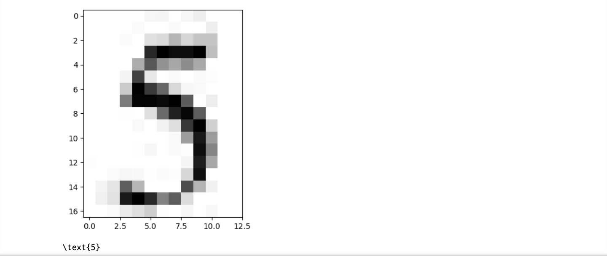

# dynamic-batch-RAG-pipeline

Dynamic batching for Document Layout and OCR, suitable for RAG.

1. Dynamic batching for SOTA Document Layout and OCR, suitable to serve better concurrency.
2. Continuous batching for Causal based OCR models.
3. Can serve user defined max concurrency.
4. Disconnected signal, so this is to ensure early stop for continuous batching.

**Yeah I know, repository name kinda sucks**.

## Available models

### Document Layout

1. https://github.com/opendatalab/DocLayout-YOLO

### OCR

1. https://huggingface.co/stepfun-ai/GOT-OCR2_0

## how to install

Using PIP with git,

```bash
pip3 install git+https://github.com/mesolitica/dynamic-batch-RAG-pipeline
```

Or you can git clone,

```bash
git clone https://github.com/mesolitica/dynamic-batch-RAG-pipeline && cd dynamic-batch-RAG-pipeline
```

## how to

### Supported parameters

```bash
python3 -m dynamicbatch_ragpipeline.main --help
```

```text
usage: main.py [-h] [--host HOST] [--port PORT] [--loglevel LOGLEVEL] [--reload RELOAD] [--model-doc-layout MODEL_DOC_LAYOUT]
               [--dynamic-batching-microsleep DYNAMIC_BATCHING_MICROSLEEP]
               [--dynamic-batching-batch-size DYNAMIC_BATCHING_BATCH_SIZE] [--accelerator-type ACCELERATOR_TYPE]
               [--max-concurrent MAX_CONCURRENT] [--hotload HOTLOAD]

Configuration parser

options:
  -h, --help            show this help message and exit
  --host HOST           host name to host the app (default: 0.0.0.0, env: HOSTNAME)
  --port PORT           port to host the app (default: 7088, env: PORT)
  --loglevel LOGLEVEL   Logging level (default: INFO, env: LOGLEVEL)
  --reload RELOAD       Enable hot loading (default: False, env: RELOAD)
  --model-doc-layout MODEL_DOC_LAYOUT
                        Model type (default: yolo10, env: MODEL_DOC_LAYOUT)
  --dynamic-batching-microsleep DYNAMIC_BATCHING_MICROSLEEP
                        microsleep to group dynamic batching, 1 / 1e-4 = 10k steps for second (default: 0.0001, env:
                        DYNAMIC_BATCHING_MICROSLEEP)
  --dynamic-batching-batch-size DYNAMIC_BATCHING_BATCH_SIZE
                        maximum of batch size during dynamic batching (default: 20, env: DYNAMIC_BATCHING_BATCH_SIZE)
  --accelerator-type ACCELERATOR_TYPE
                        Accelerator type (default: cuda, env: ACCELERATOR_TYPE)
  --max-concurrent MAX_CONCURRENT
                        Maximum concurrent requests (default: 100, env: MAX_CONCURRENT)
  --hotload HOTLOAD     Enable hot loading (default: True, env: HOTLOAD)
```

**We support both args and OS environment**.

### Run

```
python3 -m dynamicbatch_ragpipeline.main \
--host 0.0.0.0 --port 7088
```

#### Example request document layout

```bash
curl -X 'POST' \
  'http://localhost:7088/doc_layout' \
  -H 'accept: application/json' \
  -H 'Content-Type: multipart/form-data' \
  -F 'file=@stress-test/2310.01889v4.pdf;type=application/pdf' \
  -F 'iou_threshold=0.45'
```

Checkout [notebook/document-layout.ipynb](notebook/document-layout.ipynb).


#### Example request OCR

```bash
curl -X 'POST' \
  'http://localhost:7088/ocr' \
  -H 'accept: application/json' \
  -H 'Content-Type: multipart/form-data' \
  -F 'image=@stress-test/table2.png;type=image/png' \
  -F 'max_tokens=4096' \
  -F 'stream=false'
```

**Because the backend is a continuous batching, so we support streaming**.

Checkout [notebook/ocr.ipynb](notebook/ocr.ipynb).




## [Stress test](stress-test)

### Document layout

Rate of 10 users per second, total requests up to 100 users for 60 seconds on a RTX 3090 Ti,

#### Non-dynamic batching


#### Dynamic batching


### OCR

Rate of 5 users per second, total requests up to 50 users for 60 seconds,

#### Continuous batching


